# Потоки аутентификации

## Эндпоинты

| Эндпоинт | Метод | Описание |
|---|---|---|
| `/connect/authorize` | GET/POST | Точка входа Authorization Code Flow |
| `/connect/login` | POST | Аутентификация по логину/паролю |
| `/connect/mfa/verify` | POST | Проверка OTP-кода (MFA) |
| `/connect/authorize/consent` | POST | Согласие пользователя на OAuth-скоупы |
| `/connect/token` | POST | Выдача токенов (все grant types) |
| `/connect/logout` | GET/POST | Завершение сессии |
| `/connect/userinfo` | GET/POST | Получение claims пользователя |
| `/connect/revocation` | POST | Отзыв токена |
| `/connect/introspect` | POST | Интроспекция токена |
| `/connect/client-info` | GET | Метаданные клиентского приложения |
| `/api/account/password-requirements` | GET | Правила парольной политики |
| `/api/account/password/forced-change` | POST | Принудительная смена пароля |
| `/api/account/2fa/enable` | POST | Включение 2FA |
| `/api/account/2fa/confirm` | POST | Подтверждение активации 2FA |
| `/api/account/2fa/disable` | POST | Отключение 2FA |
| `/api/account/verify-email/send` | POST | Отправка верификации email |
| `/api/account/verify-email/confirm` | POST | Подтверждение верификации email |
| `/api/account/verify-phone/send` | POST | Отправка верификации телефона |
| `/api/account/verify-phone/confirm` | POST | Подтверждение верификации телефона |

## Authorization Code Flow

Стандартный OAuth 2.0 / OpenID Connect flow для веб-приложений. **PKCE обязателен.**

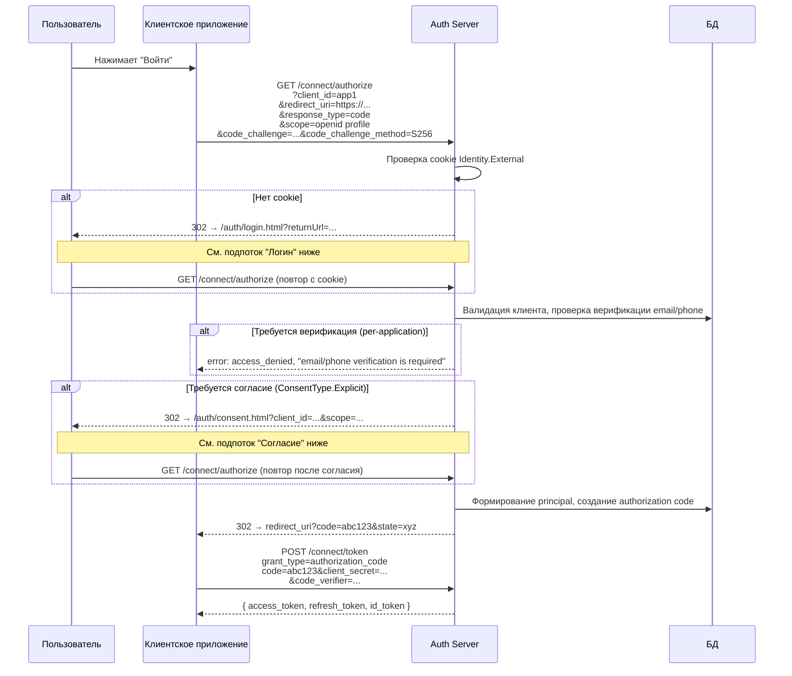

### Логин

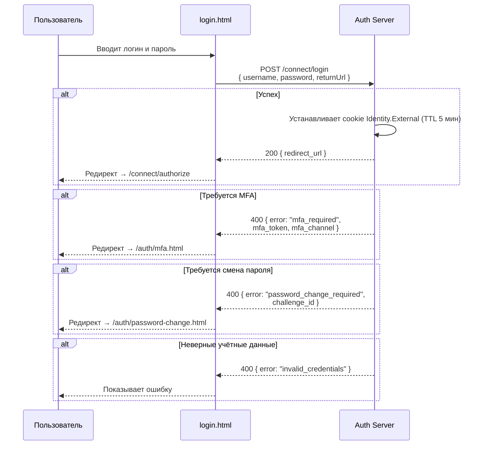

### Проверка MFA

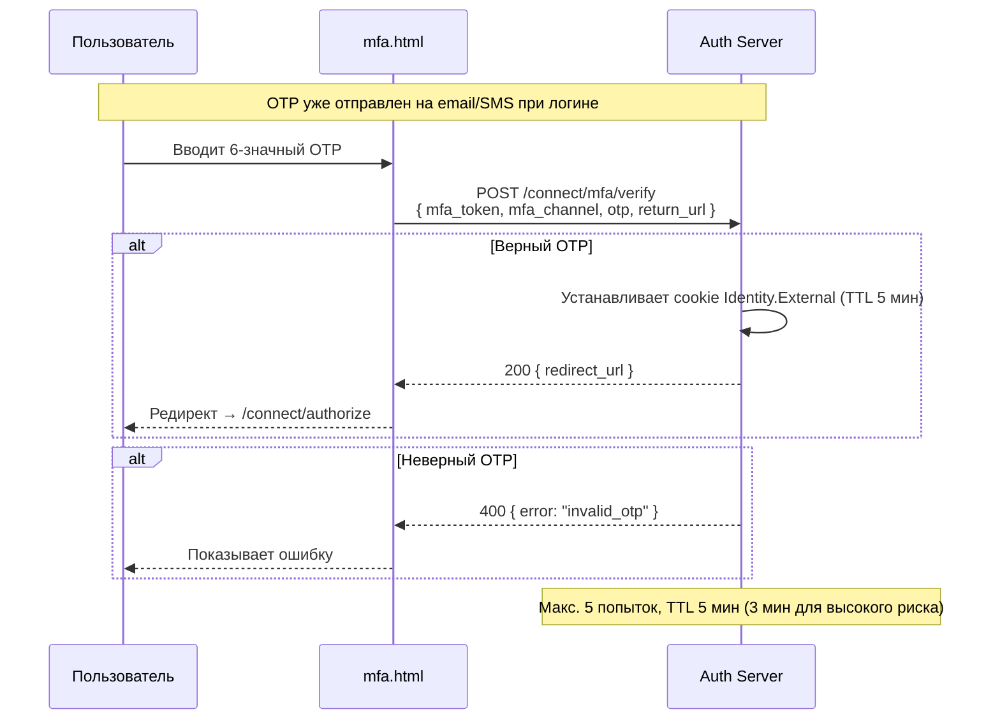

### Принудительная смена пароля

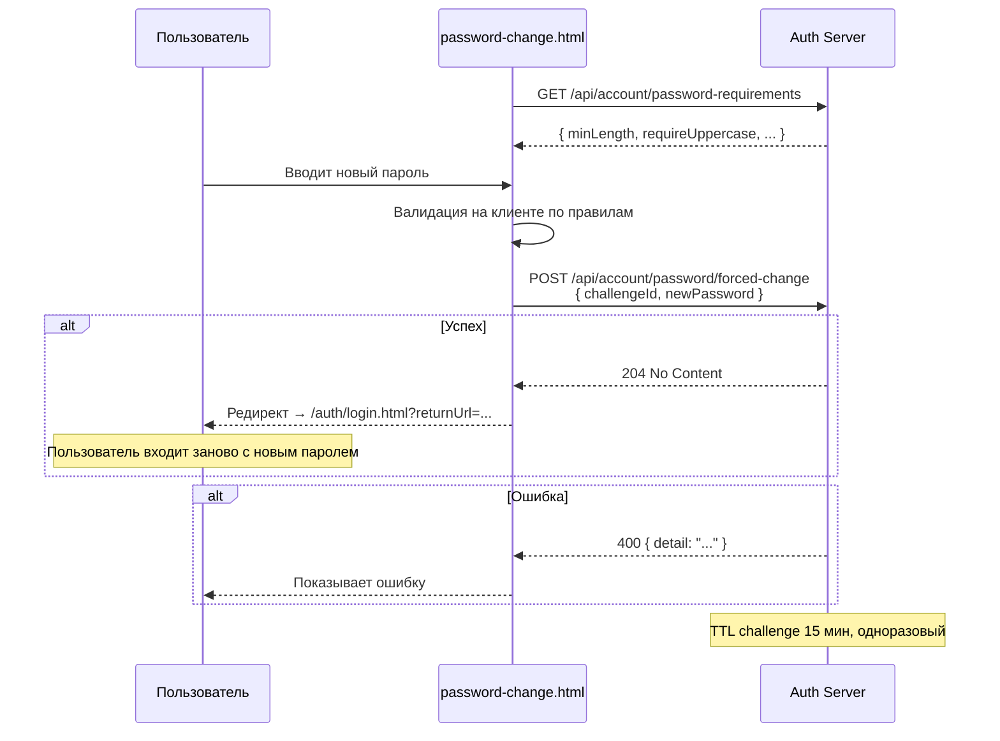

### Согласие (Consent)

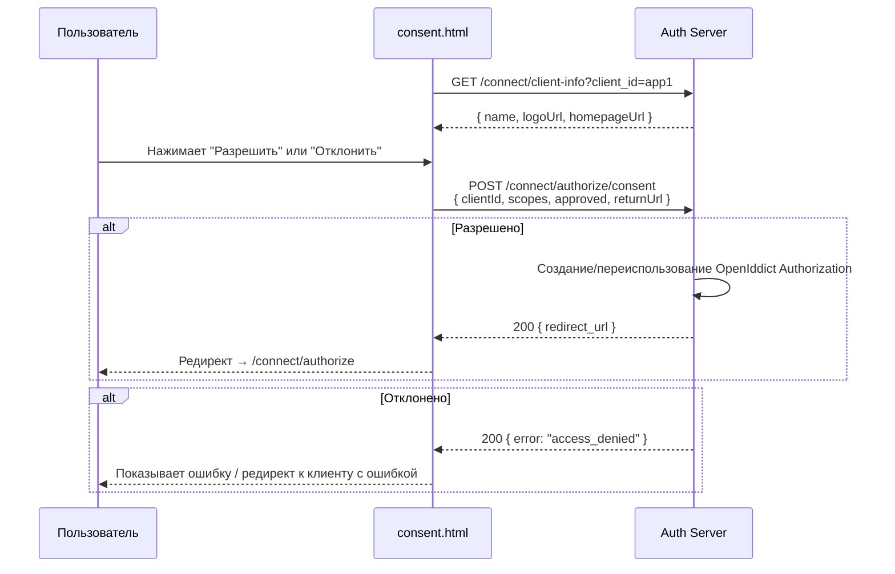

## Password Grant

Прямая выдача токенов без браузерных редиректов. Только для доверенных first-party приложений.

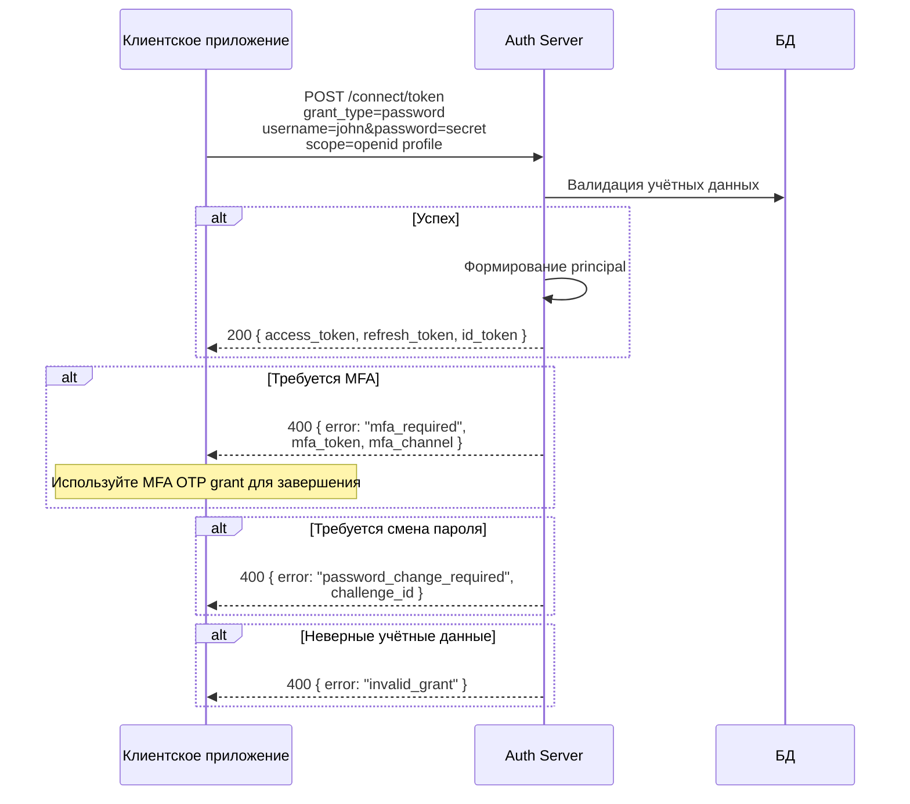

### Password Grant + MFA (двухшаговый)

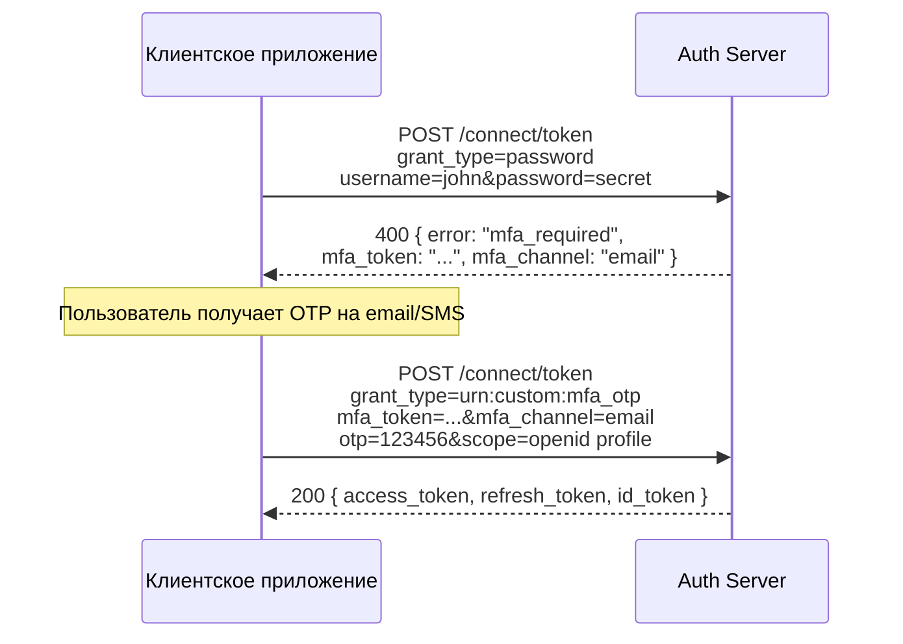

## Client Credentials Grant

Аутентификация сервис-сервис без пользовательского контекста. Используется сервисными аккаунтами.

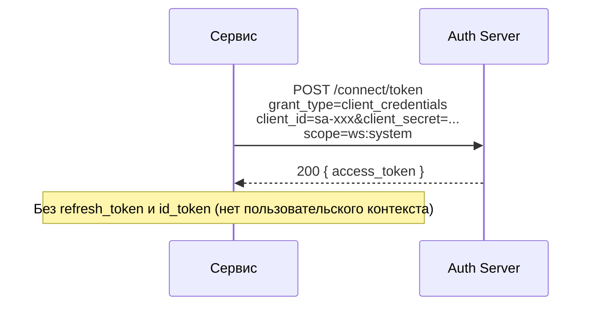

Особенности SA:
- При создании SA регистрируется OpenIddict application с `ws:*` scope permission
- При назначении workspace (SetWorkspaces) scope permissions синхронизируются: `ws:*` + `ws:{code}` для каждого назначенного workspace
- `audiences` (aud claim) берутся из поля SA, а не из таблицы applications
- `access_token_lifetime_minutes` позволяет задать индивидуальный TTL токена

## Refresh Token Grant

Refresh token rotation: при каждом обмене выдаётся новый refresh token, старый отзывается.

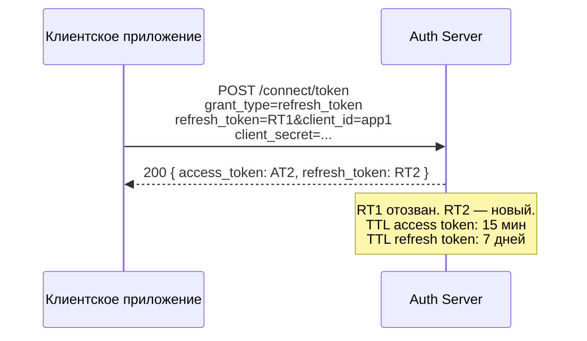

### Token rotation

- При обмене refresh token всегда выдаётся новый, старый помечается как redeemed
- **Reuse leeway** (default 30 сек) — окно, в течение которого повторное использование redeemed-токена допустимо (для race conditions)
- **Replay detection** — использование redeemed-токена за пределами leeway отзывает всю token family (все потомки)

## JWT Bearer Grant (OIDC Federation)

Федерация с внешними OIDC-провайдерами через `urn:ietf:params:oauth:grant-type:jwt-bearer`.

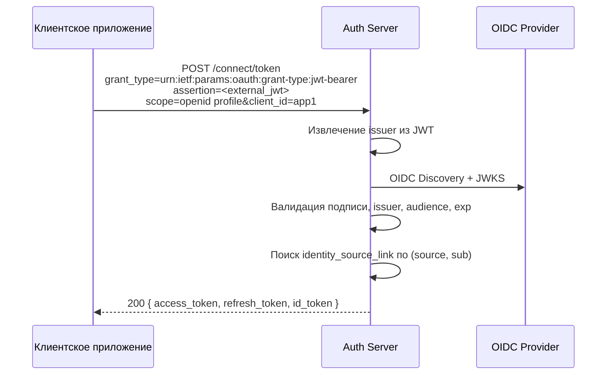

Может вернуть `mfa_required` или `password_change_required`.

## LDAP Grant

Аутентификация через LDAP-каталог. Custom grant type `urn:custom:ldap`.

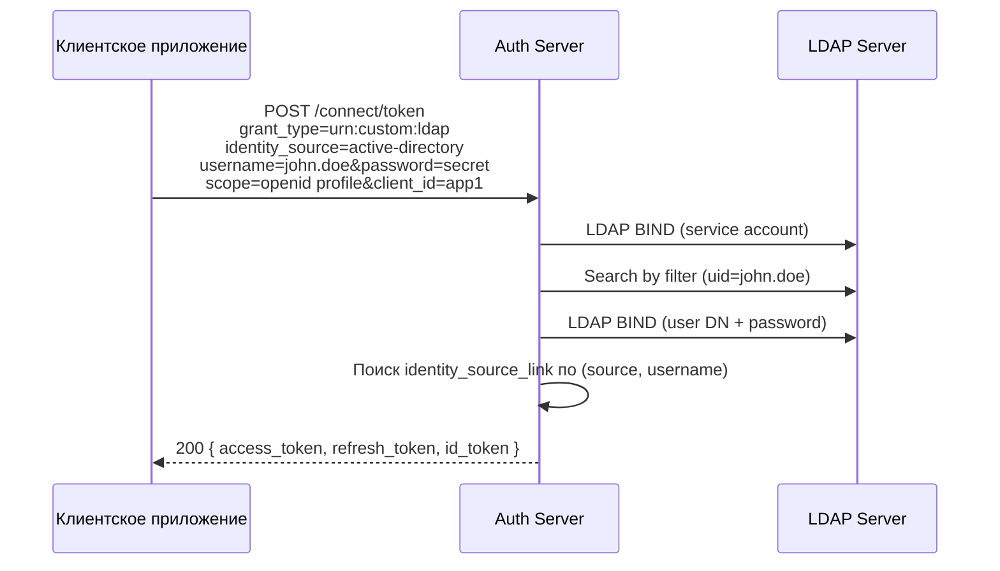

Может вернуть `mfa_required` или `password_change_required`.

## Email/Phone Verification

Per-application verification: приложение может требовать подтверждённый email и/или телефон (`require_email_verified`, `require_phone_verified`). Проверка выполняется в Authorization Code Flow при `/connect/authorize`.

### Отправка верификации

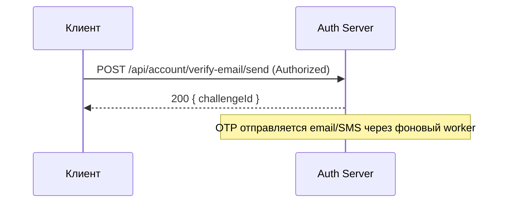

### Подтверждение верификации

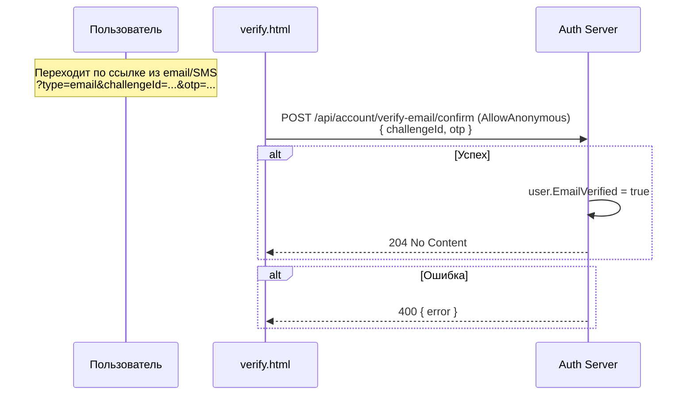

Аналогично для телефона: `verify-phone/send` и `verify-phone/confirm`.

## Logout

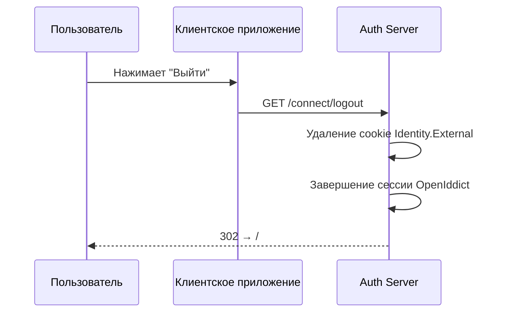

## Полный поток (максимальный сценарий)

Максимальная цепочка редиректов, когда требуются все шаги:

```
Клиентское приложение
  → GET /connect/authorize          (нет cookie)
    → /auth/login.html              (ввод учётных данных)
      → /auth/mfa.html              (ввод OTP)
        → GET /connect/authorize    (cookie установлен, проверка верификации)
          → error если email/phone не верифицирован
          → /auth/consent.html      (одобрение скоупов)
            → GET /connect/authorize (выдача кода)
              → redirect_uri?code=... (возврат к клиенту)
                → POST /connect/token (обмен кода на токены)
```

## Скоупы

| Скоуп | Описание | Claims |
|---|---|---|
| `openid` | Обязательный. Идентификация пользователя | `sub` |
| `profile` | Профиль пользователя | `name`, `preferred_username`, `locale` |
| `email` | Адрес электронной почты | `email`, `email_verified` |
| `phone` | Номер телефона | `phone_number`, `phone_number_verified` |
| `ws:*` | Все доступные рабочие пространства | `ws:{code}` (JSON с base64-encoded permission masks) |
| `ws:{code}` | Конкретное рабочее пространство | `ws:{code}` (JSON с base64-encoded permission masks) |
| `offline_access` | Выдача refresh token | - |

## Claims и destinations

| Claim | Destination |
|---|---|
| `sub` | access_token, id_token |
| `name` | access_token, id_token |
| `preferred_username` | id_token |
| `locale` | id_token |
| `email` | id_token |
| `email_verified` | id_token |
| `phone_number` | id_token |
| `phone_number_verified` | id_token |
| `auth_time` | id_token |
| `amr` | id_token |
| `pwd_exp` | access_token, id_token |
| `ws:{code}` | access_token |

`pwd_exp` — unix timestamp истечения пароля. Присутствует только если настроен password expiration (глобально или per-user).

`amr` (authentication method reference): `pwd` (пароль / LDAP), `otp` (MFA), `fed` (OIDC federation).

## Время жизни токенов

| Токен | TTL | Переопределение |
|---|---|---|
| Access token | 15 мин | per-application `access_token_lifetime_minutes` |
| Refresh token | 7 дней | per-application `refresh_token_lifetime_minutes` |
| Cookie Identity.External | 5 мин | — |
| MFA OTP challenge | 5 мин (3 мин для высокого риска) | — |
| Password change challenge | 15 мин | — |
