# Потоки аутентификации

## Эндпоинты

| Эндпоинт | Метод | Описание |
|---|---|---|
| `/connect/authorize` | GET | Точка входа Authorization Code Flow |
| `/connect/login` | POST | Аутентификация по логину/паролю |
| `/connect/mfa/verify` | POST | Проверка OTP-кода (MFA) |
| `/connect/authorize/consent` | POST | Согласие пользователя на OAuth-скоупы |
| `/connect/token` | POST | Выдача токенов (все grant types) |
| `/connect/logout` | GET/POST | Завершение сессии |
| `/connect/userinfo` | GET/POST | Получение claims пользователя |
| `/connect/client-info` | GET | Метаданные клиентского приложения |
| `/api/account/password/forced-change` | POST | Принудительная смена пароля |
| `/api/account/password-requirements` | GET | Правила парольной политики |

## Authorization Code Flow

Стандартный OAuth 2.0 / OpenID Connect flow для веб-приложений.

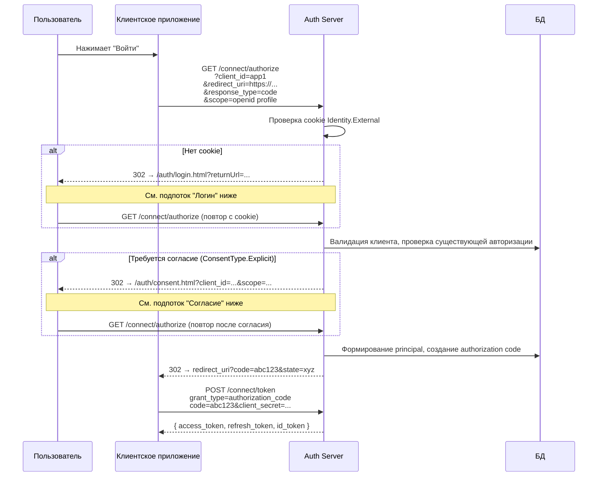

### Логин

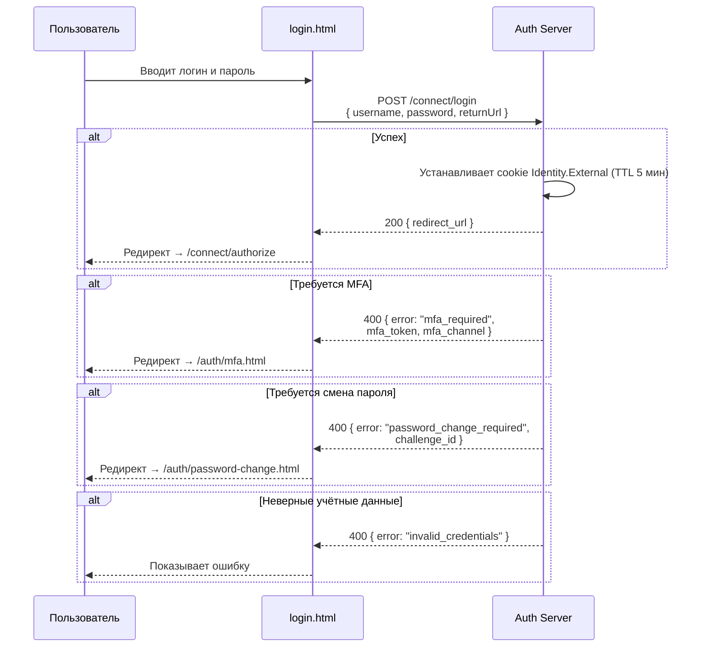

### Проверка MFA

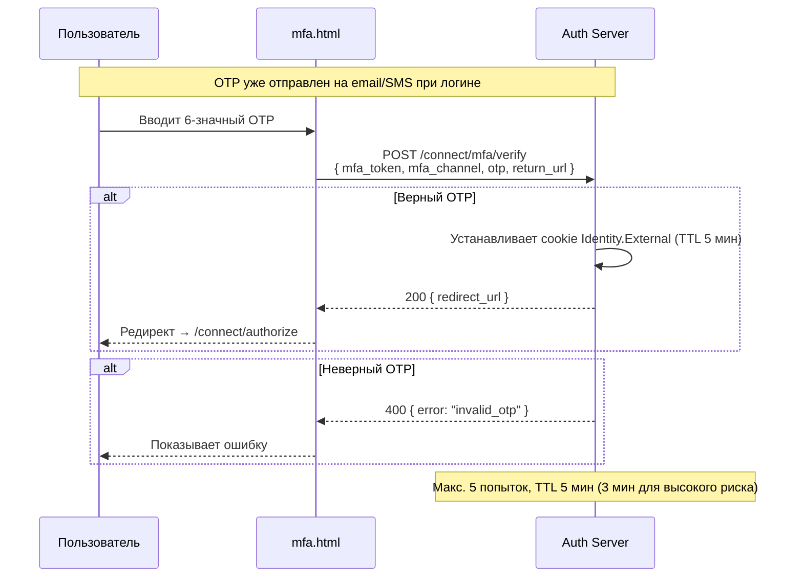

### Принудительная смена пароля

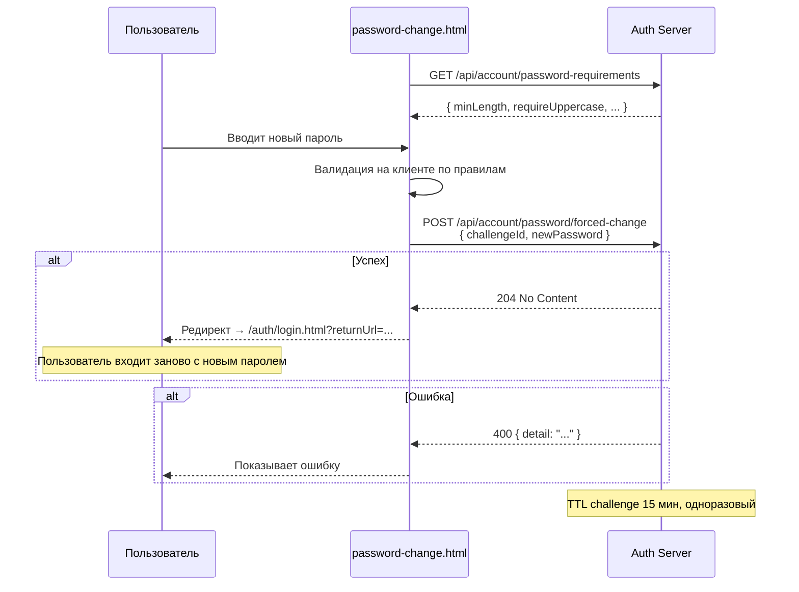

### Согласие (Consent)

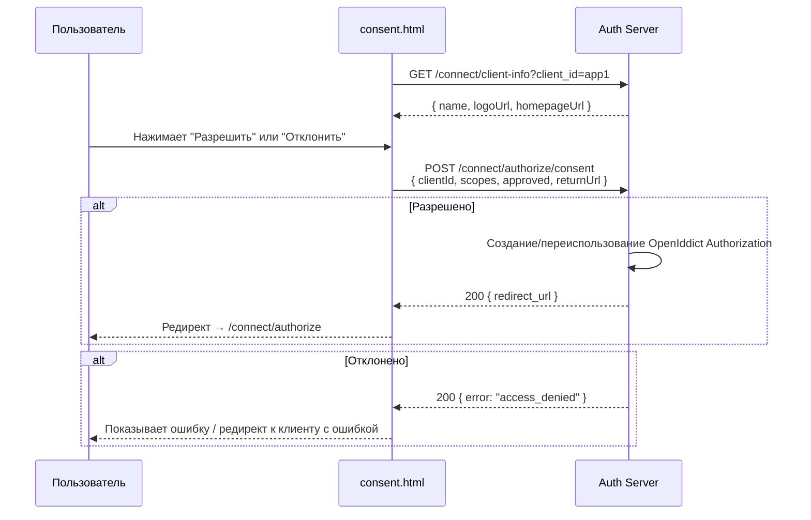

## Password Grant

Прямая выдача токенов без браузерных редиректов. Только для доверенных first-party приложений.

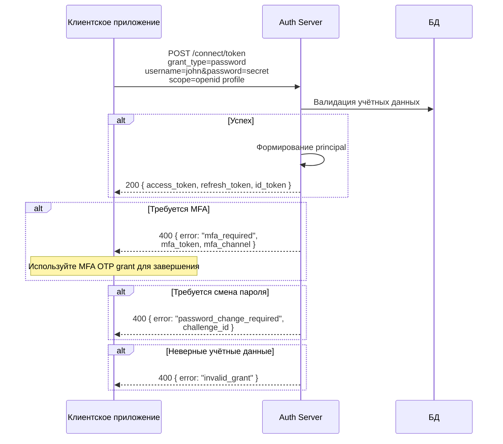

### Password Grant + MFA (двухшаговый)

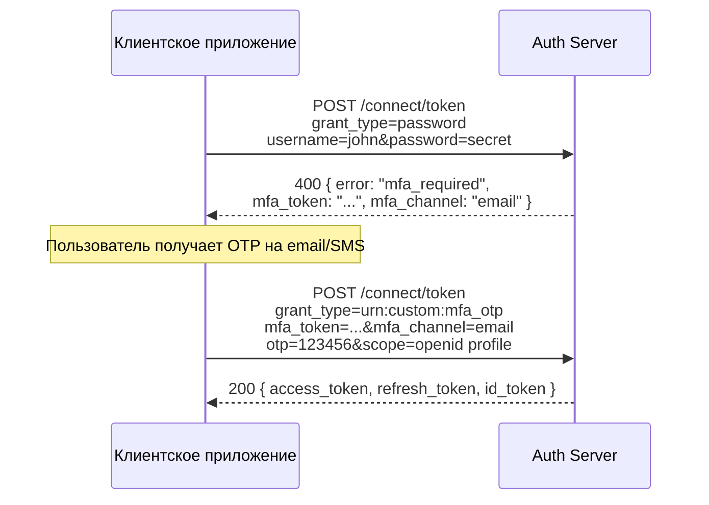

## Client Credentials Grant

Аутентификация сервис-сервис без пользовательского контекста. Используется сервисными аккаунтами.

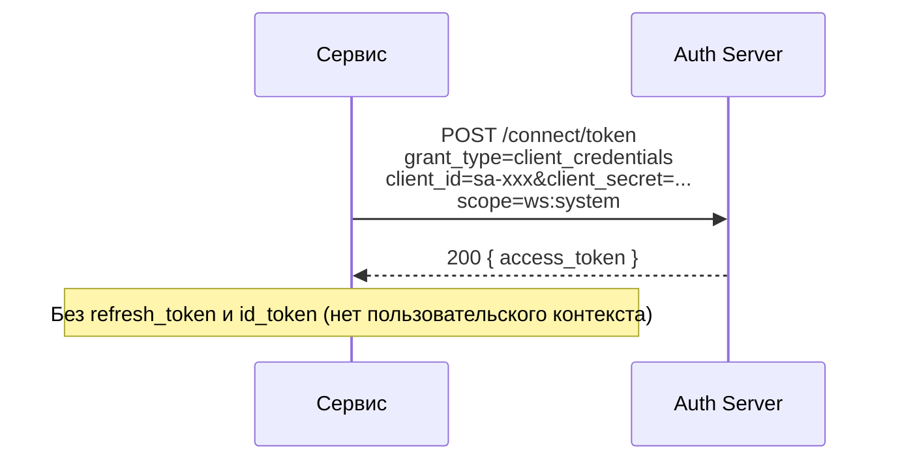

Особенности SA:
- При создании SA регистрируется OpenIddict application с `ws:*` scope permission
- При назначении workspace (SetWorkspaces) scope permissions синхронизируются: `ws:*` + `ws:{code}` для каждого назначенного workspace
- `audiences` (aud claim) берутся из поля SA, а не из таблицы applications
- `access_token_lifetime_minutes` позволяет задать индивидуальный TTL токена

## Refresh Token Grant

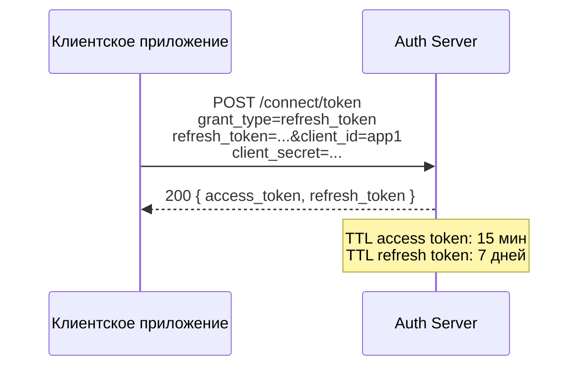

## Token Exchange Grant

Федерация с внешними источниками идентификации (например, Google).

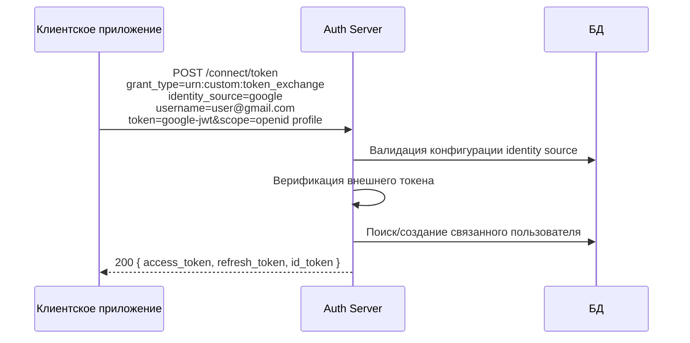

## Logout

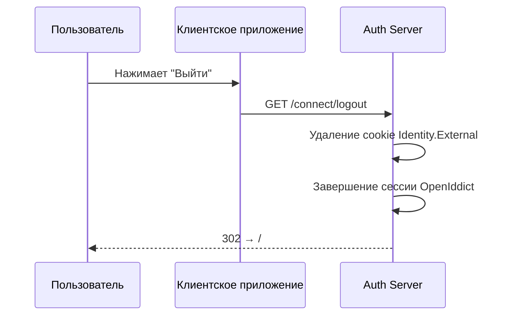

## Полный поток (максимальный сценарий)

Максимальная цепочка редиректов, когда требуются все шаги:

```
Клиентское приложение
  → GET /connect/authorize          (нет cookie)
    → /auth/login.html              (ввод учётных данных)
      → /auth/mfa.html              (ввод OTP)
        → GET /connect/authorize    (cookie установлен, требуется согласие)
          → /auth/consent.html      (одобрение скоупов)
            → GET /connect/authorize (выдача кода)
              → redirect_uri?code=... (возврат к клиенту)
                → POST /connect/token (обмен кода на токены)
```

## Скоупы

| Скоуп | Описание | Claims |
|---|---|---|
| `openid` | Обязательный. Идентификация пользователя | `sub` |
| `profile` | Профиль пользователя | `name`, `preferred_username` |
| `email` | Адрес электронной почты | `email` |
| `phone` | Номер телефона | `phone_number` |
| `ws:*` | Все доступные рабочие пространства | `ws:{code}` (base64-encoded permission masks) |
| `ws:{code}` | Конкретное рабочее пространство | `ws:{code}` (base64-encoded permission masks) |
| `offline_access` | Выдача refresh token | - |

## Время жизни токенов

| Токен | TTL |
|---|---|
| Access token | 15 мин |
| Refresh token | 7 дней |
| Cookie Identity.External | 5 мин |
| MFA OTP challenge | 5 мин (3 мин для высокого риска) |
| Password change challenge | 15 мин |
